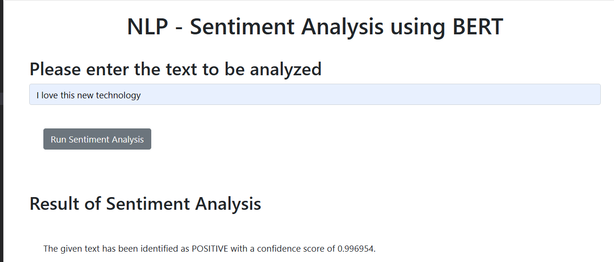

# **Emotion Detection Application**

  

## **Description**

The **Emotion Detection Application** is a web-based tool that analyzes textual data to detect and quantify the underlying emotions. This application leverages the power of **Watson NLP API** to identify key emotions such as **anger**, **disgust**, **fear**, **joy**, and **sadness**. It's an excellent tool for sentiment analysis, customer feedback evaluation, social media monitoring, and other text analytics tasks.

### **Technologies and Tools Used:**

- **Programming Language**: Python 3.11
- **Web Framework**: Flask
- **API Integration**: Watson NLP API
- **Frontend**: HTML, CSS, JavaScript (with Flask templating)
- **Version Control**: Git and GitHub
- **Deployment**: Localhost (development server)

This project is designed to be simple, intuitive, and efficient, making it easy for users to analyze the emotional content of text input.

## **Features**

- **Emotion Analysis**: Detects and reports five primary emotions: **anger**, **disgust**, **fear**, **joy**, and **sadness**.
- **Dominant Emotion Detection**: Highlights the most prominent emotion in the analyzed text.
- **Web Interface**: User-friendly interface for entering text and viewing emotion analysis results.

## **Demo**

Here’s a screenshot of the application in action:



## **Installation**

### **Prerequisites**

- Python 3.11
- Flask
- Requests Library

### **Setup**

1. **Clone the repository**:
    ```bash
    git clone https://github.com/rafaeldamouny/emotion-detection-application.git
    cd emotion-detection-application
    ```

2. **Install the necessary packages**:
    ```bash
    pip install -r requirements.txt
    ```

3. **Run the application**:
    ```bash
    python server.py
    ```

## **Usage**

1. **Navigate** to the running application in your web browser (usually `http://127.0.0.1:5000`).
2. **Enter a sentence** or phrase into the text box provided.
3. **Click "Run Sentiment Analysis"** to see the detected emotions.
4. **View Results**: The application will display the intensity of each emotion and identify the dominant emotion.

## **Error Handling**

- **Blank Input Handling**: If the user submits a blank text, the application returns the message: *"Invalid text! Please try again!"*.
- **Robustness**: The application is designed to handle bad requests efficiently, ensuring a smooth user experience.


This project is licensed under the Apache 2.0 License. See the [LICENSE](LICENSE) file for more details.

## **Acknowledgements**

- Special thanks to the **IBM Developer Skills Network** for providing the Watson NLP API and for the educational resources that supported this project.
- Appreciation goes to the **open-source community** for the tools and libraries that made this project possible.
